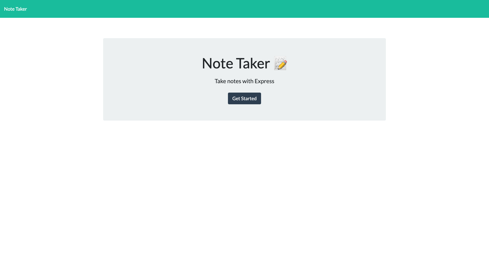

# note-taker
unlicensed
    
## Description
this project is an application called Note Taker that can be used to write and save notes.  
[project link](https://github.com/gfernandez25/note-taker)

## Table Of Contents
* [Installation](#user-content-installation)
* [Usage](#user-content-usage)
* [Licenses](#user-content-licenses)
* [Tests](#user-content-tests)
* [Questions](#user-content-questions)
    
## Installation
1. application is deployed at heroku  - https://enigmatic-depths-24846.herokuapp.com/

## Usage
enter notes as you need them

## Screenshot

## License

unlicensed
    
## Contributing
contribute as you can
 
## Tests
manual test only

## Questions
for any questions please send me and email to <> or check out my GitHub profile: [gfernandez25](https://github.com/gfernandez25)  

